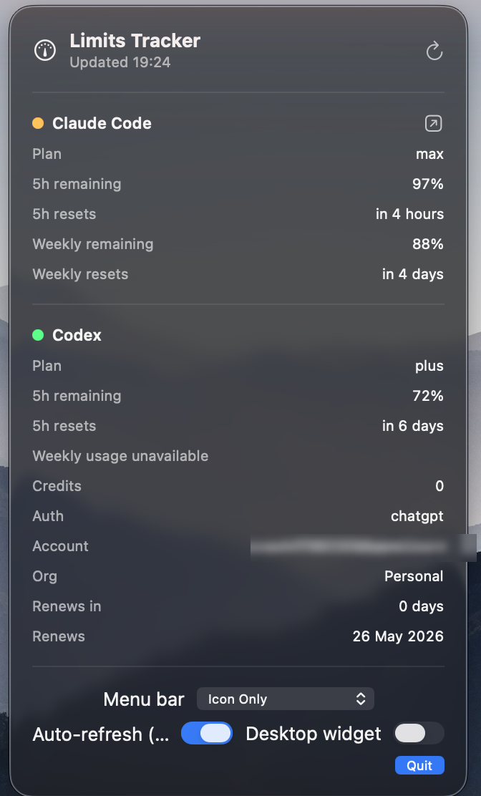

# mac-limits-tracker

A macOS menu-bar app that shows the current Claude Code and Codex CLI plan / usage state at a glance.


## Screenshots

It lives as a gauge icon in the menu bar:

<p align="center">
  
</p>

Clicking it opens the pop-up — both plans, live windows, and the display / auto-refresh controls:

<p align="center">
  
</p>

> The account e-mail is blurred in this screenshot only; the live pop-up shows it in full.

## What it shows

Clicking the gauge icon in your menu bar opens a popup with two sections:

**Claude Code**
- Subscription plan (`max`, `pro`, …) — parsed live from `claude auth status`.
- **5-hour window** — remaining % and when it resets.
- **Weekly window** — remaining % and when it resets.

Both windows are the live, server-side rate-limit quotas, fetched from `GET https://claude.ai/api/oauth/usage` using the OAuth token Claude Code keeps in the macOS Keychain. The API reports `utilization` as the share **used** (0–100); the popup shows `100 − utilization` as remaining.

**Codex (OpenAI Codex CLI)**
- ChatGPT plan type, account email, organization title — decoded from the `id_token` JWT stored in `~/.codex/auth.json`.
- `subscription_active_until` and remaining days until the renewal date in the JWT.

The status-bar tooltip shows `Claude: <plan> · Codex: <plan>` so you get the headline state without opening the popup.

## Data sources

| Source             | What it reads                                                   | How                                                                          |
|--------------------|-----------------------------------------------------------------|------------------------------------------------------------------------------|
| Claude Code auth   | subscription type, email, orgName, logged-in state              | `claude auth status` (JSON via stdout)                                       |
| Claude Code usage  | live 5h + weekly windows (`utilization`, `resets_at`)           | `GET https://claude.ai/api/oauth/usage`, Bearer token from macOS Keychain    |
| Codex auth         | `auth_mode`, `id_token` (JWT claims: plan, email, subs-until)   | `~/.codex/auth.json` — JWT body only                                         |

The Claude.ai OAuth access token is read from the Keychain service `Claude Code-credentials` and sent **only** to `claude.ai` as an `Authorization: Bearer` header — it is never logged or persisted. For Codex, only the base64-decoded JWT **claims** are inspected (plan type, email, renewal date); the `access_token` is not read unless `id_token` is missing.

## Build & run

### Requirements
- macOS 14 (Sonoma) or newer
- Xcode 15+ / Swift 5.10+ toolchain
- `claude` CLI installed and logged in (Claude Code subscription)
- `codex` CLI installed and logged in (ChatGPT auth)

### Dev (no `.app` bundle)
```bash
swift run MacLimitsTracker
```
This drops you into a SwiftUI `MenuBarExtra` immediately. The Dock icon is hidden automatically (`LSUIElement=true` / accessory activation policy).

### Production `.app`
```bash
./make-app.sh
open dist/MacLimitsTracker.app
```
`make-app.sh` runs `swift build -c release` and assembles `dist/MacLimitsTracker.app` with an `Info.plist` (`LSUIElement=true`, bundle id `dev.ascurse.MacLimitsTracker`).

### Run on boot
Add `dist/MacLimitsTracker.app` to **System Settings → General → Login Items → Open at login**.

## Project layout

```
Sources/
  MacLimitsTrackerCore/         # Library: models, JWT decode, providers, ViewModel
    Models/ClaudeModels.swift
    Models/CodexModels.swift
    Providers/LimitsProviders.swift
    LimitsViewModel.swift
  MacLimitsTracker/             # Executable: SwiftUI app shell
    App/MacLimitsTrackerApp.swift
    App/AppDelegate.swift
    UI/StatusBarView.swift
  VerifyCli/                    # CLI for ad-hoc provider debugging
Tests/MacLimitsTrackerTests/    # Pure-logic unit tests (JWT, stats-cache, claims)
make-app.sh                     # One-shot release build + bundle assembler
Package.swift
```

## Auto-refresh

The ViewModel refreshes both providers every 5 minutes by default; the popup also has a manual refresh button and an auto-refresh toggle.

## Limitations

- **The live 5h / weekly windows need a valid Claude.ai OAuth token.** The token lives in the macOS Keychain (`Claude Code-credentials`) and expires every few hours — Claude Code refreshes it on its own. When it is expired the popup shows *"claude.ai login expired — open Claude Code to refresh"* instead of stale numbers, and the next refresh picks up the new token automatically. The app does **not** refresh the token itself.
- **Codex renewal date comes from the JWT `chatgpt_subscription_active_until` claim.** This claim is set when the token is minted; after renewal the old claim is stale (the timer floors at 0 days). The actual active subscription status is enforced server-side by ChatGPT.
- The app reads `~/.claude/` and `~/.codex/` directly, so do **not** share logs/screenshots of `auth.json` contents with anyone.

## Tests & debugging

Pure-logic tests for the parsers (no network, no filesystem):
```bash
swift test
```

`VerifyCli` prints live provider output (real Keychain + network) for ad-hoc debugging. Run it in **release** — a short-lived debug SwiftPM executable that does Foundation I/O and then exits trips a spurious `nano-malloc` abort as the Swift concurrency pool tears down; the long-running menu-bar app is unaffected:
```bash
swift run -c release VerifyCli
```

## License

MIT — see [LICENSE](LICENSE).