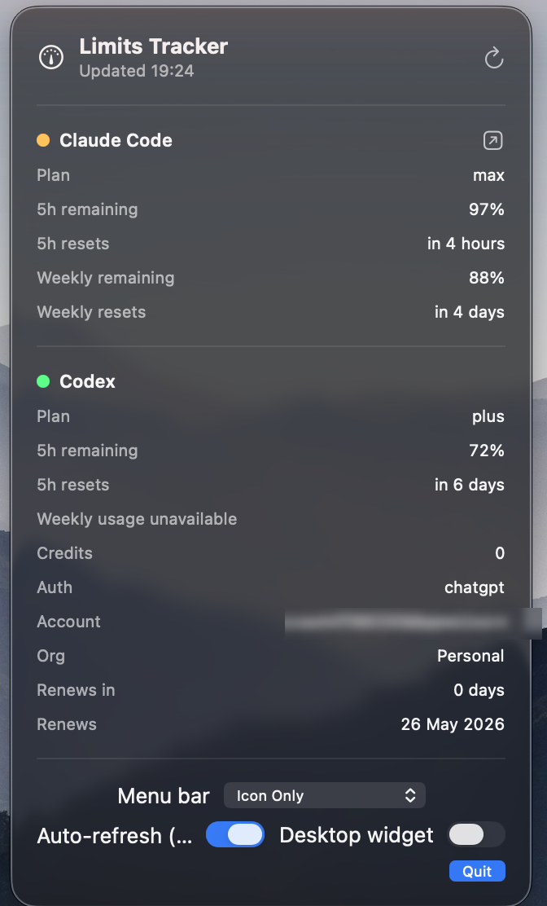

# mac-limits-tracker

A macOS menu-bar app that shows the current Claude Code, Codex CLI and Kimi Code plan / usage state at a glance.


## Screenshots

It lives as a gauge icon in the menu bar:

<p align="center">
  
</p>

Clicking it opens the pop-up — provider plans, live windows, and the display / auto-refresh controls (screenshot predates the Kimi section and sparklines):

<p align="center">
  
</p>

> The account e-mail is blurred in this screenshot only; the live pop-up shows it in full.

## What it shows

Clicking the gauge icon in your menu bar opens a popup with one section per enabled provider:

**Claude Code**
- Subscription plan (`max`, `pro`, …) — parsed live from `claude auth status`.
- **5-hour window** — remaining % and when it resets.
- **Weekly window** — remaining % and when it resets.

Both windows are the live, server-side rate-limit quotas, fetched from `GET https://claude.ai/api/oauth/usage` using the OAuth token Claude Code keeps in the macOS Keychain. The API reports `utilization` as the share **used** (0–100); the popup shows `100 − utilization` as remaining.

**Codex (OpenAI Codex CLI)**
- **5-hour** and **weekly windows** — remaining % and when they reset, fetched live by spawning `codex app-server` as a subprocess and calling `account/rateLimits/read` over its JSON-RPC (stdin/stdout) interface. This is independent of the token in `~/.codex/auth.json` — the `codex` binary manages its own auth.
- ChatGPT plan type, account email, organization title — decoded from the `id_token` JWT stored in `~/.codex/auth.json` (used as a fallback for plan type if the live app-server response doesn't include one).
- `subscription_active_until` and remaining days until the renewal date in the JWT.

**Kimi Code**
- Shown only when `~/.kimi-code/credentials/kimi-code.json` has a usable refresh token — otherwise the provider is silently absent from the popup, menu bar and desktop widget.
- Membership level (e.g. `Intermediate`) — from `membership.level` in the live usage response, falling back to a plan claim in the access-token JWT.
- Rate-limit windows from `limits[]` (e.g. a 5-hour window) — remaining % and reset time.
- A **Quota** row for the purchased, non-expiring credit pool (`usage.limit` / `.used` / `.remaining`) — this is a running balance, not a time window, so it's shown as a detail line rather than a progress window.
- Usage is fetched live from `GET https://api.kimi.com/coding/v1/usages`; the OAuth access token is short-lived (~15 min) and refreshed automatically via `https://auth.kimi.com/api/oauth/token`, rewriting the credentials file in place.

Under each window row, the popup also renders a **24-hour sparkline** built from locally recorded history samples (see [Usage history](#usage-history)).

Hovering the menu-bar icon shows a tooltip with every enabled provider's plan and window remaining %, e.g. `Claude: Max · 5h 78% · weekly 95% · Codex: Plus · 5h 99% · weekly 82%`, so you get the headline state without opening the popup.

## Themes

The popup supports four themes, switchable from the footer picker:

- **System** — native macOS look (default). Rows use the provider's accent color only; window bars are **not** tinted by severity.
- **Terminal** — Tokyo Night palette with progress bars, tinted normal / warning / critical by severity.
- **Phosphor** — monochrome green CRT with `█░` bars; only critical is visually distinct (inverted bar), warning renders the same as normal.
- **TUI** — htop-style panels with `[||||··]` gauges, tinted normal / warning / critical by severity.

The choice is persisted in `UserDefaults` (`appTheme`). The menu-bar icon/label and the desktop widget are never tinted by severity, regardless of theme.

## Usage history

Every successful refresh appends one sample per (provider, window) to a local history file (`history.json` in `~/Library/Application Support/dev.ascurse.MacLimitsTracker/`), deduplicating unchanged values and pruning anything older than 7 days. The popup's sparklines (see [What it shows](#what-it-shows)) plot the last 24 hours of that history; the desktop widget does not show sparklines.

## Notifications

Turning on **Notifications** in the popup footer (off by default) asks macOS for notification permission and starts watching every enabled provider's windows for two kinds of events:

- **Threshold crossed** — fires once when a window's remaining % drops into the warning zone (default ≤ 40%) or critical zone (default ≤ 15%); recovering above a zone re-arms it so a later re-entry notifies again. Title: `"<Provider>: <Window> window low"` / `"...critical"`, body: `"<N>% remaining"`.
- **Window reset** — fires when a window's reset time changes to a new value. Title: `"<Provider>: <Window> window reset"`, body: `"Limit window has reset"`.

Both warning and critical thresholds are configurable from a fixed set of options in the footer ("Warning at" / "Critical at"); critical is always kept below warning. Dedup state is kept in memory only — restarting the app can produce one repeat notification for a window that's already past its threshold.

Notifications require the app to run as a proper `.app` bundle (`./make-app.sh`); they are a silent no-op under `swift run`.

## Settings

Everything below lives in the popup footer and persists across restarts:

| Control | Options | Default |
|---|---|---|
| Theme | System / Terminal / Phosphor / TUI | System |
| Menu bar | Icon + Plan / Icon Only / Icon + 5h % / Icon + 5h / Weekly % | Icon + Plan |
| Refresh every | 30 sec / 1 min / 5 min / 15 min | 5 min |
| Warning at | 20 / 30 / 40 / 50 / 60% remaining | 40% |
| Critical at | 5 / 10 / 15 / 20 / 25% remaining (below warning) | 15% |
| Providers | per-provider enable + reorder (▲/▼) | all enabled, registry order |
| Auto-refresh | on/off | on |
| Desktop widget | on/off | off |
| Notifications | on/off | off |
| Launch at login | on/off (disabled outside a bundled `.app`) | off |

## Desktop widget

Besides the menu-bar popup there is an optional always-on-desktop panel: enable **Desktop widget** in the popup footer. It floats at desktop level on all Spaces, shows one row per window with data for every *enabled* provider (not just Claude/Codex) as progress bars, can be dragged anywhere (position persists across restarts via native window frame autosave), and refreshes together with the menu-bar data. It does not show sparklines or severity tinting.

## Data sources

| Source              | What it reads                                                      | How                                                                                             |
|---------------------|----------------------------------------------------------------------|---------------------------------------------------------------------------------------------------|
| Claude Code auth    | subscription type, email, orgName, logged-in state                   | `claude auth status` (JSON via stdout)                                                            |
| Claude Code usage   | live 5h + weekly windows (`utilization`, `resets_at`)                 | `GET https://claude.ai/api/oauth/usage`, Bearer token from macOS Keychain                          |
| Codex usage         | live 5h + weekly windows, plan type, credits, rate-limit-reached type | `codex app-server` subprocess, JSON-RPC `account/rateLimits/read` over stdin/stdout                |
| Codex auth          | `auth_mode`, `id_token` (JWT claims: plan fallback, email, subs-until) | `~/.codex/auth.json` — JWT body only, read by us; the `codex` binary handles its own auth network calls |
| Kimi credentials    | access/refresh token, expiry, presence gates whether Kimi registers  | `~/.kimi-code/credentials/kimi-code.json`                                                          |
| Kimi usage          | membership level, rate-limit windows, purchased-quota balance         | `GET https://api.kimi.com/coding/v1/usages`, Bearer access token                                   |
| Kimi token refresh  | new access/refresh token when the ~15-min access token expires        | `POST https://auth.kimi.com/api/oauth/token`, rewrites the credentials file in place               |

The Claude.ai OAuth access token is read from the Keychain service `Claude Code-credentials` and sent **only** to `claude.ai` as an `Authorization: Bearer` header — it is never logged or persisted. For Codex, only the base64-decoded JWT **claims** are inspected (plan type, email, renewal date); the `access_token` is not read unless `id_token` is missing, and the live rate-limit call goes through the `codex` binary itself, not through a token we hold. The Kimi access token is sent only to `api.kimi.com` / `auth.kimi.com`.

## Install

Download `MacLimitsTracker.zip` from the [latest release](https://github.com/Ascurse/mac-limits-tracker/releases/latest), unzip it and move `MacLimitsTracker.app` to `/Applications`. The binary is universal (Apple Silicon + Intel).

The app is **not signed with an Apple Developer certificate**, so on first launch Gatekeeper will block it. Either right-click the app → **Open** → **Open**, or remove the quarantine attribute:

```bash
xattr -dr com.apple.quarantine /Applications/MacLimitsTracker.app
```

Releases are built by GitHub Actions: pushing a `v*` tag (e.g. `v0.2.0`) builds the universal binary, assembles the `.app` and publishes a release with the zip attached.

## Build & run

### Requirements
- macOS 14 (Sonoma) or newer
- Xcode 15+ / Swift 5.10+ toolchain
- `claude` CLI installed and logged in (Claude Code subscription), for the Claude section
- `codex` CLI installed and logged in (ChatGPT auth), for the Codex section — the app spawns `codex app-server` itself to fetch live rate limits
- Kimi Code CLI logged in (`~/.kimi-code/credentials/kimi-code.json` present with a valid refresh token) to enable the Kimi section — optional, the provider is simply hidden without it

### Dev (no `.app` bundle)
```bash
swift run MacLimitsTracker
```
This drops you into a SwiftUI `MenuBarExtra` immediately. The Dock icon is hidden automatically (`LSUIElement=true` / accessory activation policy).

### Production `.app`
```bash
./make-app.sh
open dist/MacLimitsTracker.app
```
`make-app.sh` runs `swift build -c release` and assembles `dist/MacLimitsTracker.app` with an `Info.plist` (`LSUIElement=true`, bundle id `dev.ascurse.MacLimitsTracker`).

### Run on boot
Toggle **Launch at login** in the popup footer (uses `SMAppService`, macOS 13+). Alternatively, add `dist/MacLimitsTracker.app` to **System Settings → General → Login Items → Open at login** manually.

## Project layout

```
Sources/
  MacLimitsTrackerCore/         # Library: models, JWT decode, providers, ViewModel
    Models/ClaudeModels.swift
    Models/CodexModels.swift
    Models/KimiModels.swift
    Models/SeverityThresholds.swift
    Models/UsageSample.swift
    Providers/LimitsProviders.swift     # Claude / Codex / Kimi providers
    Providers/KimiTokenRefresher.swift
    Providers/AppSettingsStore.swift
    Providers/ProviderSettingsStore.swift
    Storage/HistoryStore.swift          # usage-history persistence
    Formatting/LimitsFormatting.swift
    NotificationEvaluator.swift
    LimitsViewModel.swift
  MacLimitsTracker/             # Executable: SwiftUI app shell
    App/MacLimitsTrackerApp.swift
    App/AppDelegate.swift
    App/LaunchAtLoginManager.swift
    Notifications/NotificationManager.swift
    UI/StatusBarView.swift              # theme dispatcher
    UI/SystemStatusView.swift
    UI/TerminalStatusView.swift
    UI/PhosphorStatusView.swift
    UI/TUIStatusView.swift
    UI/PopupFooter.swift
    UI/DesktopWidgetView.swift
    UI/DesktopWidgetController.swift
  VerifyCli/                    # CLI for ad-hoc provider debugging
Tests/MacLimitsTrackerTests/    # Pure-logic unit tests (JWT, stats-cache, claims, history, notifications, ...)
make-app.sh                     # One-shot release build + bundle assembler
Package.swift
```

## Auto-refresh

The ViewModel refreshes every enabled provider on a single shared timer, every 5 minutes by default (configurable to 30 sec / 1 min / 5 min / 15 min in the footer — see [Settings](#settings)); the popup also has a manual refresh button and an auto-refresh toggle.

## Limitations

- **The live 5h / weekly windows need a valid Claude.ai OAuth token.** The token lives in the macOS Keychain (`Claude Code-credentials`) and expires every few hours — Claude Code refreshes it on its own. When it is expired the popup shows *"claude.ai login expired — open Claude Code to refresh"* instead of stale numbers, and the next refresh picks up the new token automatically. The app does **not** refresh the token itself.
- **Codex renewal date comes from the JWT `chatgpt_subscription_active_until` claim.** This claim is set when the token is minted; after renewal the old claim is stale (the timer floors at 0 days). The actual active subscription status is enforced server-side by ChatGPT.
- **Codex live windows need the `codex` binary reachable and `codex app-server` working.** If the binary can't be found or the subprocess call fails/times out (25s), the Codex section shows an error instead of stale numbers.
- **Kimi login expiry doesn't clear `loggedIn`.** If the refresh token itself is rejected, the popup shows *"Kimi login expired — open Kimi Code to refresh"* as a usage error, but the provider still reports as logged in — only the usage fetch fails.
- **Notifications need a bundled `.app`.** Under `swift run` the notification manager is a no-op (no bundle ID for `UNUserNotificationCenter` to attach to).
- **Notification dedup doesn't survive a restart.** State is in-memory only, so restarting the app can re-fire one notification for a window that's already past its threshold.
- **Usage history is capped at 7 days** and stored unencrypted at `~/Library/Application Support/dev.ascurse.MacLimitsTracker/history.json`.
- The app reads `~/.claude/`, `~/.codex/` and `~/.kimi-code/` directly, so do **not** share logs/screenshots of their auth/credentials files with anyone.

## Tests & debugging

Pure-logic tests for the parsers (no network, no filesystem):
```bash
swift test
```

`VerifyCli` prints live provider output (real Keychain + network) for ad-hoc debugging. Run it in **release** — a short-lived debug SwiftPM executable that does Foundation I/O and then exits trips a spurious `nano-malloc` abort as the Swift concurrency pool tears down; the long-running menu-bar app is unaffected:
```bash
swift run -c release VerifyCli
```

## Contributing

Contributions are welcome — see [CONTRIBUTING.md](CONTRIBUTING.md) for how to report bugs, propose features, and submit pull requests. Participation is governed by the [Code of Conduct](CODE_OF_CONDUCT.md). Found a security issue? Please report it privately via [SECURITY.md](SECURITY.md).

## License

MIT — see [LICENSE](LICENSE).